# **Bitmap.ev3是什么?**

Bitmap.ev3是一个在ev3上实现的地图库，可以在ev3上快速开发带有地图的游戏。

# Bitmap.ev3有哪些函数？

bitmap.ev3很简单，它只有5个函数：

1.**bm_mk**：初始化地图

2.**bm_disp**：显示地图

3.**bm_box**：填充某块区域

4.**bm_del**：取消某块区域的填充

5.**bm_check**：检查某块区域是否被填充

# **如何使用Bitmap.ev3?**

1.从Github上下载Bitmap.ev3，打开后点击Program进入主程序。

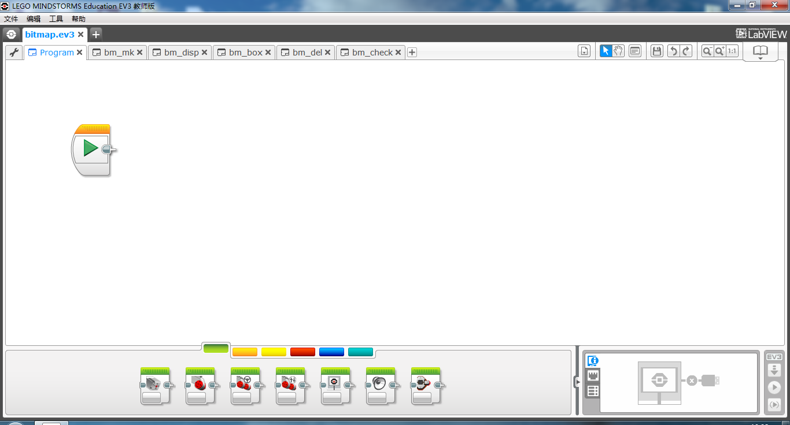

2.创建一个逻辑阵列，用来储存地图信息，这里命名为example

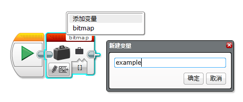

3.接着在我的模块中拖动出bm_mk函数，用来初始化地图。不要忘记清屏！

*注意：在某些版本的EV3中，重置屏幕选项是无效的，可以通过显示一个空格来进行清屏。*

*注意：请不要使用名为bitmap的逻辑阵列，此阵列是用作缓存的，使用该阵列会导致异常情况。*

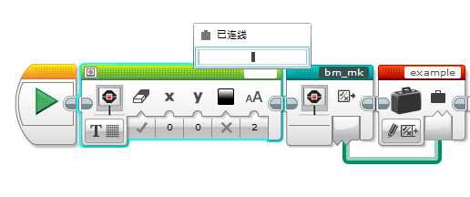

4.添加bm_disp函数来显示example地图

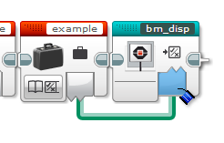

5.在程序末尾加上永远循环，避免程序退出

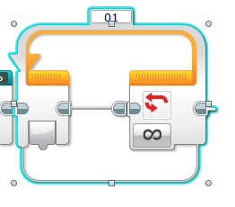

6.现在整个程序应该是这样的，接着将程序下载到ev3上，你可以看到一个空的地图：

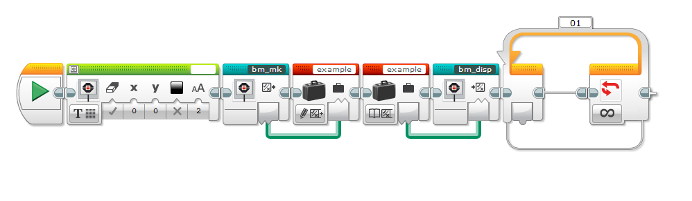

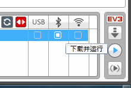

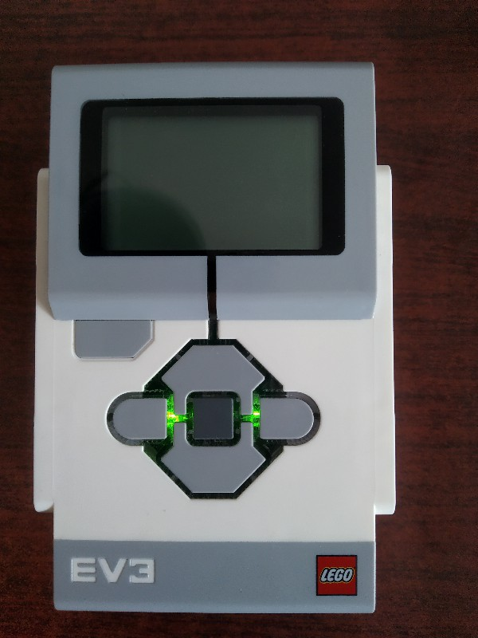

7.接着在创建函数和显示函数中间加入bm_box函数，用来生成一个从点A(3,3)到点B(7,7)的正方形。现在把程序下载到ev3上，你会看到一个正方形：

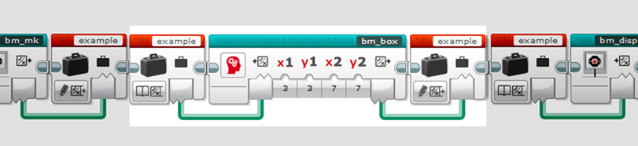

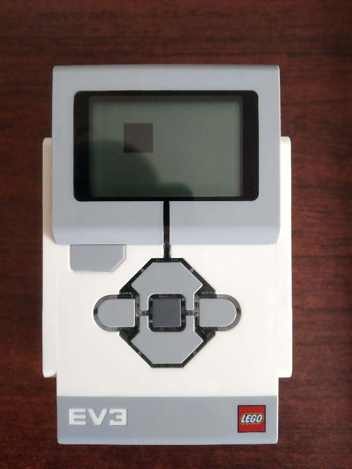

8.接着我们在程序末尾加入一个bm_check函数，用来判断指定点(9,9)有没有被填充，有则显示True，没有则显示False，现在把程序下载，果然显示False：

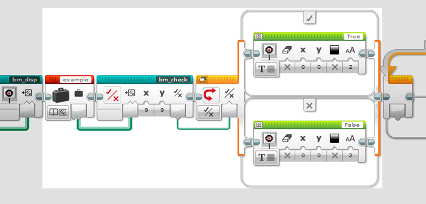

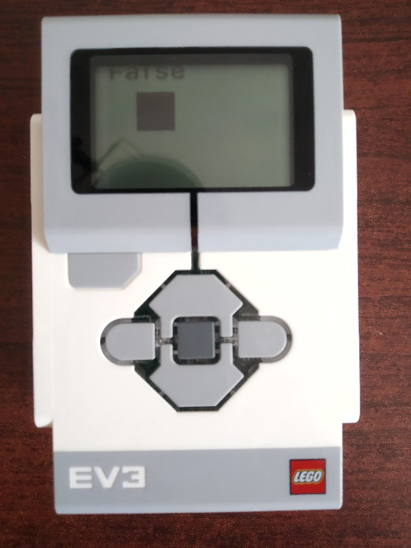

9.我们试着把xy改成3,3，再运行程序，因为点3,3刚才被bm_box函数填充过，所以它显示True。

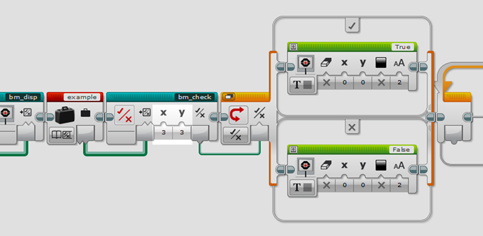

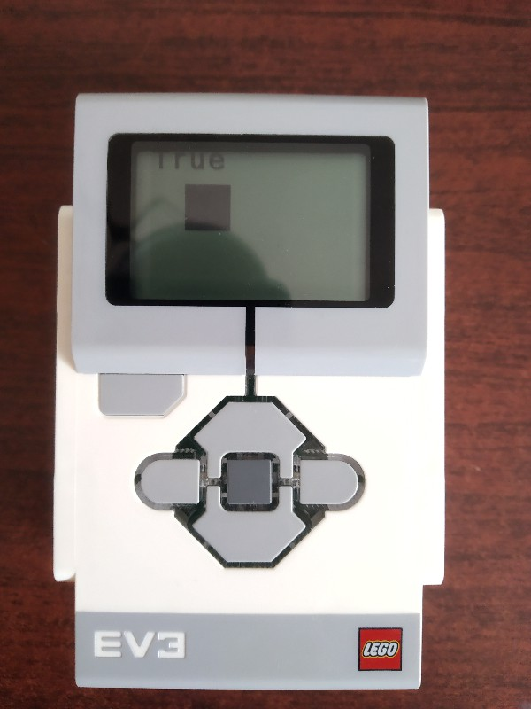

10.接着我们在bm_box函数和bm_disp函数中间加上bm_del函数，删除从A(3,3)到B(6,6)的填充。在运行程序，我们发现从(3,3)到(6,6)的部分变成了空白。到这里，你就学会了bitmap.ev3的所有函数了。

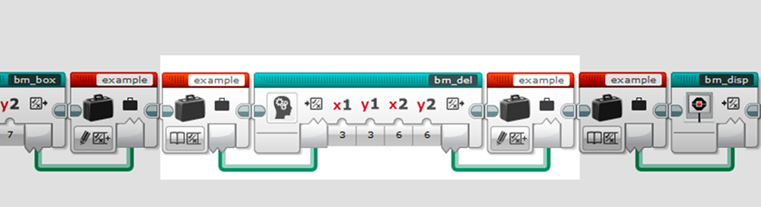

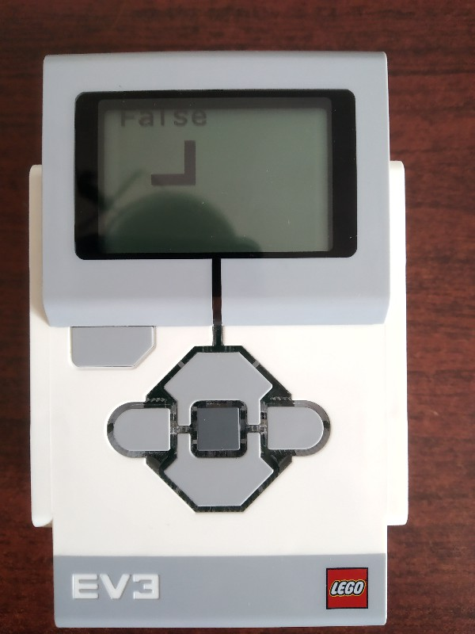